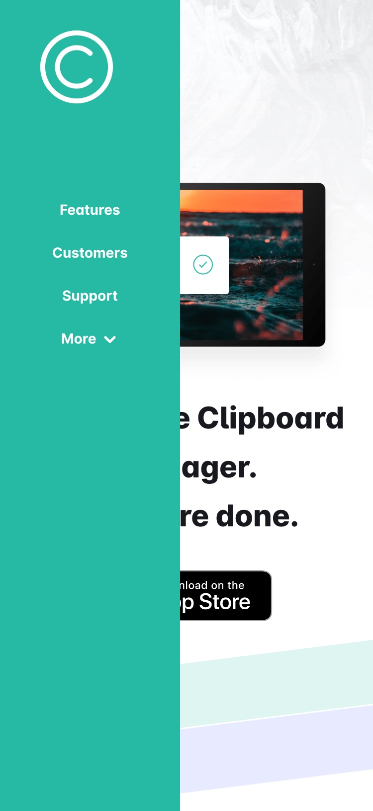

# Clipboard Manager Design
 

> Design files of this Awesome app Website!

## Sommaire
* [Contexte du projet](#Contexte-du-projet)
* [Visuel](#Visuel)
* [Tools](#Tools)
* [Références](#Références)
* [Contact](#contact)

## Contexte-du-projet
**Design d'un site de promotion de l'application Clipboard Manager.**

Ce projet s'inscrit dans le cursus de la formation Studi "full stack Développeur Web et Web Mobile".

- Il correspond à l'acquisition des compétences front-end "Maquetter une application".

### Résultats attendus
+ Conception d'une maquette comprenant au choix :
    - Wireframes papier (scanné) ou numérique
    - Mockup sur Photoshop/AdobeXD/Figma
  
NB : Le nombre d'écrans à fournir est au minimum de 2 (version desktop & mobile). Dans un format PDF/PNG.

## Visuel
1.  [Figma Wireframe layer]

2.  [Figma Style guide layer]

3.  [Figma Medias layer]

4.  [Figma Mobile mockup layer]

5.  [Figma Mobile sidebar layer]
    

6.  [Figma Desktop mockup layer]

## Tools
* Figma Desktop App
* Affinity Photo

## Références
Proto en ligne : [ici](https://www.figma.com/proto/pCwsMFkTSvHROuS7zKSdxs/EE-maquetter-une-application?node-id=32%3A1527&scaling=scale-down&page-id=1%3A2)

Dépôt Github du projet : [ici](https://github.com/pga61/clipboard-manager-design)

## Contact
Conception [@Philippe](https://philippe-gaspel.me) - feel free to contact me!

